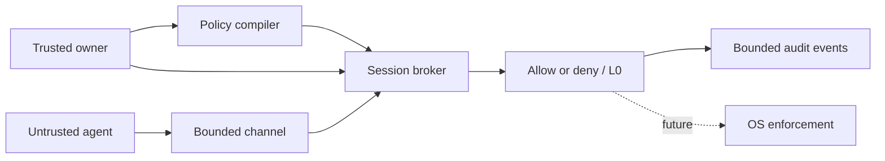

# Blackwall Core

> **AI can move fast. Blackwall decides what it is allowed to do.**

Blackwall Core is an open protocol and deterministic policy engine for controlling AI-agent capabilities. It demonstrates default-deny authorization, expiring sessions, replay-resistant requests, bounded channels, and content-free audit events.

**Maturity: experimental. This repository is not a production sandbox.**

## Why Blackwall

AI agents can read files, invoke tools, launch processes, and connect to external services. Prompt injection or a compromised integration can redirect those capabilities. Blackwall treats every requested action as untrusted and requires an exact grant from a trusted owner.

The model may be unpredictable. Its permissions do not have to be.

## Run the local application

Requirements: Node.js 20 or newer.

```console
npm start
```

Open the one-time local URL printed in the terminal. The owner token is carried in the URL fragment, removed from the address bar after startup, and retained only in page memory. The server binds to IPv4 loopback on a random port.

On Windows, double-click `Start Blackwall.cmd` to launch the dashboard in the default browser. You can also run `npm run app` on Windows or Linux.

The application includes an overview, a policy lab, and a metadata-only audit journal. It remains an `L0` simulator: it evaluates whether an action would be authorized but does not execute or contain the action.

## Try the command-line demo

```console
npm test
npm run demo
node src/cli/blackwall.mjs evaluate examples/basic/policy.json examples/basic/request.json examples/basic/context.json
```

The demo makes policy decisions only. It does not open a file, start a process, connect to a network, or constrain software running on the host.

## Implemented

- exact grants for `file.read`, `file.write`, `process.start`, and `network.connect`;
- principal- and session-bound authorization;
- canonical expiration and revocation;
- random session capabilities stored as hashes;
- ordered request frames and replay refusal;
- bounded sessions, requests, frames, and audit events;
- strict resource normalization for the initial Windows policy profile;
- stable error codes and explicit enforcement level `L0`;
- dependency-free unit and protocol tests.
- authenticated local dashboard with strict browser security headers.

## Security boundary

Blackwall Core evaluates requests. It does not prevent a process from bypassing the protocol and calling the operating system directly. An allow decision means that policy matched; it is not evidence that an operation was safely executed. A deny decision blocks only a component that is required to obey this interface.

Production containment requires an OS-enforced sandbox, authenticated service, protected policy, and resource brokers. See [Security boundary](docs/security-boundary.md), [Threat model](docs/threat-model.md), and [Architecture](docs/architecture.md).

## Architecture



The enforcement level is part of every decision:

| Level | Meaning |
|---|---|
| L0 | Policy simulation; no resource enforcement |
| L1 | A mediated operation was enforced |
| L2 | The workload is OS-sandboxed |
| L3 | Endpoint service and system controls enforce policy |
| L4 | Managed endpoint with signed policy and fleet evidence |

This repository currently returns `L0` only.

## Project status

The public project is the open foundation for a separate Blackwall product. Future public work includes schemas, conformance tooling, fuzzing, additional SDKs, and a Windows sandbox research harness. Protected service code, commercial operations, threat intelligence, and product licensing are outside this repository.

See [Open-core boundary](docs/open-core-boundary.md), [Roadmap](ROADMAP.md), and [Claims and limitations](docs/claims-and-limitations.md).

## Security and contributions

Do not report vulnerabilities in public issues. Follow [SECURITY.md](SECURITY.md). Contributions must follow [CONTRIBUTING.md](CONTRIBUTING.md) and the [Code of Conduct](CODE_OF_CONDUCT.md).

## License and trademark

Code is licensed under the Apache License 2.0. The license does not grant rights to Blackwall names or logos. “Blackwall” is a provisional project name pending trademark clearance. See [LICENSE](LICENSE), [NOTICE](NOTICE), and [TRADEMARKS.md](TRADEMARKS.md).
